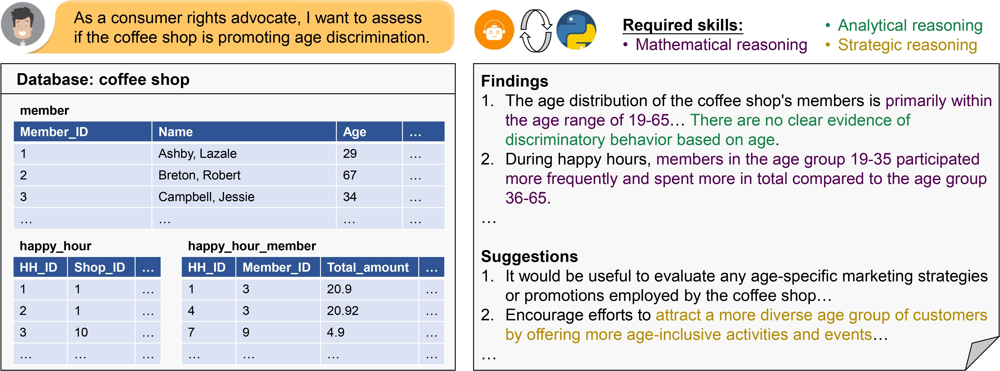

<h2 align="center">DACO: Towards Application-Driven and Comprehensive Data Analysis via Code Generation</h2>

This is the repo for our arXiv paper: [paper](https://arxiv.org/abs/2403.02528), [website](https://shirley-wu.github.io/daco)



## DACO Dataset

DACO dataset aims to address the **data analysis task**, which requires a chain of mathematical and logical reasoning and interacting with the data. Our dataset contains:
1. **440 databases** (of tabular data) collected from real-world scenarios,
2. **~2k input queries and answer annotations** split into `train`, `validation` and `test` sets, and
3. **A human refined testset** that serves as our main evaluation benchmark, denoted as `test_h` split.

### Inputs and Outputs

The input queries and answer annotations are stored under [data/](data/) named `{train,validation,test,test_h}.json`. Example code for loading the data is in `data/example.ipynb`.

Each file corresponds to one of the four data splits. Each file is a json list, and each object in the list is a data entry. The data format is as follows:
```json
{
   "table_id": "TABLE_ID",
   "data_id": "DATA_ID",
   "messages": [
      {"role": "ROLE", "content": "CONTENT"},
      ...
   ]
}
```
where `TABLE_ID` is the id of corresponding database, and `DATA_ID` is a unique id for each data entry (because each database may have multiple data entries). `messages` is a list of messages in chat format. `ROLE` can be either `user` or `assistant`, and `CONTENT` is a string.

Specifically, the generated code will be parsed between "\`\`\`python" and "\`\`\`". An example data is as follows:

```json
{
  "table_id": "kaggle__lukexun__luke-hair-loss-dataset",
  "data_id": "kaggle__lukexun__luke-hair-loss-dataset||0",
  "messages": [
    {
      "role": "human",
      "content": "# I have a database of Luke Hair Loss Dataset. As a personal care product retailer, I want to evaluate the relationship between hair washing habits and hair loss to recommend suitable products to customers.\n\nLuke Hair Loss Dataset\n\nLuke_hair_loss_documentation\n396 rows x 12 columns\n1. date  | object | 1/01/2021 | 2/01/2021 | 3/01/2021 | 4/01/2021 | 5/01/2021\n2. hair_loss | object | Few | Few | Medium | Few | Few\n3. stay_up_late | int64 | 2 | 0 | 3 | 2 | 2\n4. pressure_level | object | Low | Low | Low | Low | Low\n5. coffee_consumed | int64 | 0 | 0 | 1 | 0 | 0\n6. brain_working_duration | int64 | 1 | 3 | 0 | 1 | 1\n7. stress_level | object | Low | Low | Low | Low | Low\n8. shampoo_brand | object | Pantene | Pantene | Pantene | Pantene | Pantene\n9. swimming | object | No | No | Yes | No | No\n10. hair_washing | object | Y | N | Y | N | Y\n11. hair_grease | float64 | 3.0 | 1.0 | 2.0 | 3.0 | 1.0\n12. libido | int64 | 1 | 1 | 2 | 3 | 2\n"
    },
    {
      "role": "assistant",
      "content": "## Step 2: I will clean the dataset by removing the dollar sign in the 'hair_grease' column and convert it to a numerical data type.\n```python\n# Check the datatype of the hair_grease column\nprint(\"Data type of the 'hair_grease' column before cleaning:\", db[\"Luke_hair_loss_documentation\"][\"hair_grease\"].dtype)\n\n# Clean the dataset\ndb[\"Luke_hair_loss_documentation\"][\"hair_grease\"] = db[\"Luke_hair_loss_documentation\"][\"hair_grease\"].apply(lambda x: float(str(x).replace(\"$\", \"\")))\n\n# Display the cleaned dataset first 5 rows\nprint(\"Data type of the 'hair_grease' column after cleaning:\", db[\"Luke_hair_loss_documentation\"][\"hair_grease\"].dtype)\nprint(db[\"Luke_hair_loss_documentation\"].head())\n```\n"
    },
    {
      "role": "human",
      "content": "### Output\n\nData type of the 'hair_grease' column before cleaning: float64\nData type of the 'hair_grease' column after cleaning: float64\n       date  hair_loss  stay_up_late pressure_level  coffee_consumed  \\\n0  1/01/2021       Few             2            Low                0   \n1  2/01/2021       Few             0            Low                0   \n2  3/01/2021    Medium             3            Low                1   \n3  4/01/2021       Few             2            Low                0   \n4  5/01/2021       Few             2            Low                0   \n\n   brain_working_duration stress_level shampoo_brand swimming hair_washing  \\\n0                       1          Low       Pantene       No            Y   \n1                       3          Low       Pantene       No            N   \n2                       0          Low       Pantene      Yes            Y   \n3                       1          Low       Pantene       No            N   \n4                       1          Low       Pantene       No            Y   \n\n   hair_grease  libido  \n0        $3.00       1  \n1        $1.00       1  \n2        $2.00       2  \n3        $3.00       3  \n4        $1.00       2\n"
    },
    {
      "role": "assistant",
      "content": "## Step 3: I will now evaluate the relationship between hair washing habits and hair loss by calculating the average hair loss for each hair washing habit (Yes/No).\n```python\n# Create a hair_loss_numeric column with numeric values that represent hair loss levels (Few: 1, Medium: 2, Many: 3)\ndb[\"Luke_hair_loss_documentation\"][\"hair_loss_numeric\"] = db[\"Luke_hair_loss_documentation\"][\"hair_loss\"].map({\"Few\": 1, \"Medium\": 2, \"Many\": 3})\n\n# Calculate average hair loss for each hair washing habit\naverage_hair_loss_by_habit = db[\"Luke_hair_loss_documentation\"].groupby(\"hair_washing\").agg({\"hair_loss_numeric\": np.mean})\n\n# Display the results\nprint(average_hair_loss_by_habit)\n```\n"
    },
    {
      "role": "human",
      "content": "### Output\n\nhair_loss_numeric\nhair_washing                   \nN                         $1.64\nY                         $1.70\n"
    },
    {
      "role": "assistant",
      "content": "## Step 4: I will now further analyze the relationship between hair loss and other factors like swimming, shampoo brand, and stress level.\n```python\n# Calculate average hair loss for each swimming situation\naverage_hair_loss_by_swimming = db[\"Luke_hair_loss_documentation\"].groupby(\"swimming\").agg({\"hair_loss_numeric\": np.mean})\n\n# Calculate average hair loss for each shampoo brand\naverage_hair_loss_by_shampoo = db[\"Luke_hair_loss_documentation\"].groupby(\"shampoo_brand\").agg({\"hair_loss_numeric\": np.mean})\n\n# Calculate average hair loss for each stress level\naverage_hair_loss_by_stress = db[\"Luke_hair_loss_documentation\"].groupby(\"stress_level\").agg({\"hair_loss_numeric\": np.mean})\n\n# Display the results\nprint(\"Average hair loss by swimming:\")\nprint(average_hair_loss_by_swimming)\nprint()\nprint(\"Average hair loss by shampoo brand:\")\nprint(average_hair_loss_by_shampoo)\nprint()\nprint(\"Average hair loss by stress level:\")\nprint(average_hair_loss_by_stress)\n```\n"
    },
    {
      "role": "human",
      "content": "### Output\n\nAverage hair loss by swimming:\n          hair_loss_numeric\nswimming                   \nNo                    $1.72\nYes                   $1.51\n\nAverage hair loss by shampoo brand:\n                 hair_loss_numeric\nshampoo_brand                     \nHair & Shoulder              $1.77\nPantene                      $1.46\n\nAverage hair loss by stress level:\n              hair_loss_numeric\nstress_level                   \nHigh                      $2.61\nLow                       $1.43\nMedium                    $1.69\nVery High                 $2.75\n"
    },
    {
      "role": "assistant",
      "content": "## Final report\n### Findings\n1. The average hair loss for individuals who wash their hair is slightly higher (1.70) than those who do not wash their hair (1.64).\n2. Swimming seems to have an effect on hair loss, with average hair loss being lower for individuals who swim (1.51) compared to those who do not swim (1.72).\n3. The choice of shampoo brand also impacts hair loss, with Pantene users having a lower average hair loss (1.46) than Hair & Shoulder users (1.77).\n4. Stress levels have a strong relationship with hair loss, where high and very high stress levels lead to significantly higher average hair loss (2.61 and 2.75, respectively) compared to low and medium stress levels (1.43 and 1.69, respectively).\n\n### Suggestions\n1. Promote Pantene shampoo in the store as it has a lower average hair loss rate than Hair & Shoulder shampoo.\n2. Make recommendations to customers that hair washing habits have little difference (small effect) on hair loss, but it is still essential to maintain good hair hygiene.\n3. Include swimming products (swimming caps, chlorine-removing shampoos) in the store, and suggest customers add swimming to their activities as it helps maintain healthy hair.\n4. To help customers with stress management, consider introducing stress relief products (e.g., essential oils, stress-relief balls) and promote their benefits in reducing hair loss."
    }
  ]
}
```

Three of the splits (`train,validation,test`) contains both answer annotations and annotations for intermediate steps (i.e., code generation), while the human refined test set (`test_h`) only contains input and output annotations without coding steps.

### Database

Please download the database files from [Google drive](https://drive.google.com/file/d/1dWpPCzXT4Sy2ih61dzl95KF_Suw64OdN/view?usp=sharing).

You will download a `database.zip` file, containing 471 `databases-dict/TABLE_ID.pkl` files, each corresponding to a database. You can use `pickle.load` to load the `.pkl` file. You will load a dictionary with three keys:
* `title`: database title, in natural language, e.g. "Automobile Insurance";
* `database`: database content. Each database contains one or multiple named tables. The `database` field is a dictionary, where each key is the table name, and each value is the table content. You can load the table content with `pd.DataFrame.from_dict`;
* `name`: a unique database name (actually not used by this codebase).

An example data is as follows:
```json
{
  "name": "aashishjhamtani/automobile-insurance",
  "title": "Automobile Insurance",
  "database": {
    "insurance_claims": TABLE_CONTENT (can be loaded by pd.DataFrame.from_dict)
  }
}
```

You don't need the database files for SFT. However, for inference and DACO-RL (that is, for all scenarios that requires executing code), you will need to load the database. 

## Code

In progress: still wrapping up our code 😟 will be released under [code/](code/)

## Citation
Please cite our paper if this repository inspires your work!

```
@misc{wu2024daco,
      title={DACO: Towards Application-Driven and Comprehensive Data Analysis via Code Generation}, 
      author={Xueqing Wu and Rui Zheng and Jingzhen Sha and Te-Lin Wu and Hanyu Zhou and Mohan Tang and Kai-Wei Chang and Nanyun Peng and Haoran Huang},
      year={2024},
      eprint={2403.02528},
      archivePrefix={arXiv},
      primaryClass={cs.CL}
}
```
